# Smart Locker System

||||
|-------|-------|--------|
|  | 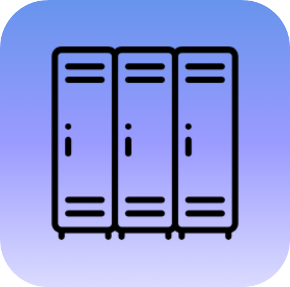 |  |

A comprehensive locker reservation and management system consisting of a Spring Boot backend server and an Android mobile application.

## 📋 Project Overview

The Smart Locker System is a full-stack application that allows users to find, reserve, and manage smart lockers in various locations. The system provides real-time locker availability, location-based search, and reservation management capabilities.

## 🏗️ System Architecture

### Backend (Spring Boot Server)
- **Framework**: Spring Boot with MongoDB
- **Architecture**: Layered architecture with clear separation of concerns
- **API**: RESTful web services
- **Database**: MongoDB for data persistence

### Frontend (Android Application)
- **Platform**: Android (Kotlin)
- **Architecture**: MVVM with LiveData and ViewModels
- **UI**: Material Design components
- **Maps Integration**: Google Maps API
- **Navigation**: Navigation Component

## 🚀 Features

### User Management
- User registration and authentication
- Profile management with editable fields
- Role-based access control (ADMIN, OPERATOR, END_USER)

### Locker Management
- Location-based locker search
- Real-time availability checking
- Locker reservation system
- Status tracking (available, occupied, out of order)

### Reservation System
- Make new reservations
- View current active reservations
- Reservation history tracking
- Timer-based reservation expiration
- Cancel/complete reservations

### Smart Locker Interaction
- NFC-based locker access
- QR code scanning capabilities (future enhancement)
- Physical locker status control
- Real-time lock/unlock functionality
- Unity simulator integration for locker status updates

### Administrative Features
- Command execution system
- Bulk data management
- User and object administration
- Command history tracking

## 🛠️ Technology Stack

### Backend Technologies
- **Java 17** with Spring Boot
- **Spring Data MongoDB** for database operations
- **Spring Web** for REST API development
- **Maven** for dependency management
- **MongoDB** as the primary database

### Frontend Technologies
- **Kotlin** for Android development
- **Android Architecture Components** (ViewModel, LiveData)
- **Retrofit** for API communication
- **Google Maps SDK** for location services
- **Material Design Components**
- **Navigation Component** for app navigation
- **NFC Technology** for locker access and interaction

## 📁 Project Structure

### Backend Structure
```text
src/main/java/demo/
│
├── Application.java
├── BusinessLogicLayer/
│   ├── Converters/         # Entity-Boundary converters
│   ├── Exceptions/         # Custom exception classes
│   └── Services/           # Business logic implementation
├── DataAccessLayer/
│   ├── CRUDs/              # MongoDB repository interfaces
│   ├── Entities/           # Database entity classes
│   └── IDs/                # ID wrapper classes
├── PresentationLayer/
│   ├── Boundaries/         # API request/response DTOs
│   └── Controllers/        # REST API controllers
├── Enums/                  # Enumeration classes
└── Initializers/           # Data initialization utilities
```

---

### Frontend Structure
```text
app/src/main/java/com/example/smartlockersystem/
│
├── adapters/               # RecyclerView adapters
├── Dialogs/                # Custom dialog fragments
├── LoginRegistration/      # Authentication activities
├── models/                 # Data model classes
├── network/                # API service and networking
├── repository/             # Data repository layer
├── serverData/             # Server response DTOs
├── ui/                     # UI fragments and ViewModels
│   ├── history/            # Reservation history
│   ├── mainMap/            # Map and location features
│   ├── profile/            # User profile management
│   └── rental/             # Current reservation management
└── utils/                  # Utility classes
```

---

---


## 🔧 API Endpoints

### User Management
| Method | Endpoint | Description | Access Level |
|--------|----------|-------------|--------------|
| `POST` | `/ambient-intelligence/users` | Create new user | Public |
| `GET` | `/ambient-intelligence/users/login/{systemID}/{userEmail}` | User login | Public |
| `PUT` | `/ambient-intelligence/users/{systemID}/{userEmail}` | Update user | Authenticated |
| `GET` | `/ambient-intelligence/admin/users` | Get all users | Admin only |

### Object Management
| Method | Endpoint | Description | Access Level |
|--------|----------|-------------|--------------|
| `POST` | `/ambient-intelligence/objects` | Create object | Operator only |
| `GET` | `/ambient-intelligence/objects` | Get all objects | Authenticated |
| `GET` | `/ambient-intelligence/objects/{systemID}/{objectID}` | Get specific object | Authenticated |
| `PUT` | `/ambient-intelligence/objects/{systemID}/{objectID}` | Update object | Operator only |

### Command System
| Method | Endpoint | Description | Access Level |
|--------|----------|-------------|--------------|
| `POST` | `/ambient-intelligence/commands` | Execute command | End User only |
| `GET` | `/ambient-intelligence/admin/commands` | Get command history | Admin only |

### Search Operations
| Method | Endpoint | Description | Access Level |
|--------|----------|-------------|--------------|
| `GET` | `/ambient-intelligence/objects/search/byType/{type}` | Search by type | Authenticated |
| `GET` | `/ambient-intelligence/objects/search/byStatus/{status}` | Search by status | Authenticated |
| `GET` | `/ambient-intelligence/objects/search/byAlias/{alias}` | Search by alias | Authenticated |

## 🎯 Core Commands

The system supports various commands through the command execution system:

- **`echo`** - Simple echo command for testing
- **`create`** - Create new objects (lockers, reservations)
- **`update`** - Modify existing objects
- **`delete`** - Remove objects
- **`get`** - Retrieve object information
- **`getavailablelockers`** - Find available lockers by location
- **`getreservationsbystatus`** - Get user's status reservations
- **`changelockerstatus`** - Toggle locker lock/unlock status

## 🔒 Security & Permissions

### User Roles
- **ADMIN**: Full system access, user management, data export
- **OPERATOR**: Object management, locker operations
- **END_USER**: Locker reservation and usage

### Permission Matrix
| Operation | ADMIN | OPERATOR | END_USER |
|-----------|-------|----------|----------|
| Create Objects | ❌ | ✅ | ❌ |
| View All Objects | ❌ | ✅ | ✅ (Active only) |
| Execute Commands | ❌ | ❌ | ✅ |
| User Management | ✅ | ❌ | ❌ |
| System Administration | ✅ | ❌ | ❌ |

## 🚀 Getting Started

### Prerequisites
- Java 17 or higher
- MongoDB 4.4+
- Android Studio Arctic Fox or later
- Google Maps API key
- NFC-enabled Android device (for locker interaction)
- Unity Simulator (for locker status simulation)

### Backend Setup

1. **Clone the repository**
   ```bash
   git clone <repository-url>
   cd smart-locker-system/backend
   ``` 
2. **Configure MongoDB**
   ```application.properties
   spring.data.mongodb.uri=mongodb://localhost:27017/smartlocker
   spring.application.name=2025b.Eden.Mendler
   ```
3. **Run the application**
   ```bash
    mvn spring-boot:run
   ```
4. **Access the API**

   - Server runs on http://localhost:8084
   - API documentation available at endpoints listed above

### Android App Setup (Fronted)
1. **Open project in Android Studio**

2. **Configure required permissions**
    - Location permissions (for maps)
    - Internet permission (for API calls)
    - NFC permission (for locker interaction)

3. **Configure Google Maps API** 

   - Create local.properties file
   
      ```properties
      googleMapsKey=YOUR_GOOGLE_MAPS_API_KEY_HERE
      ```
     
4. **Update server URL In `RetrofitClient.kt`**
   ```kotlin
   .baseUrl("http://YOUR_SERVER_IP:8084/")
   ```
   
5. **Build and run**

   - Sync project with Gradle files
   - Run on device or emulator

### Object Types
- **`lockerBlock`**: Physical locations containing multiple lockers
- **`locker`**: Individual storage units
- **`reservation`**: User bookings for lockers

### 🔄 Data Flow
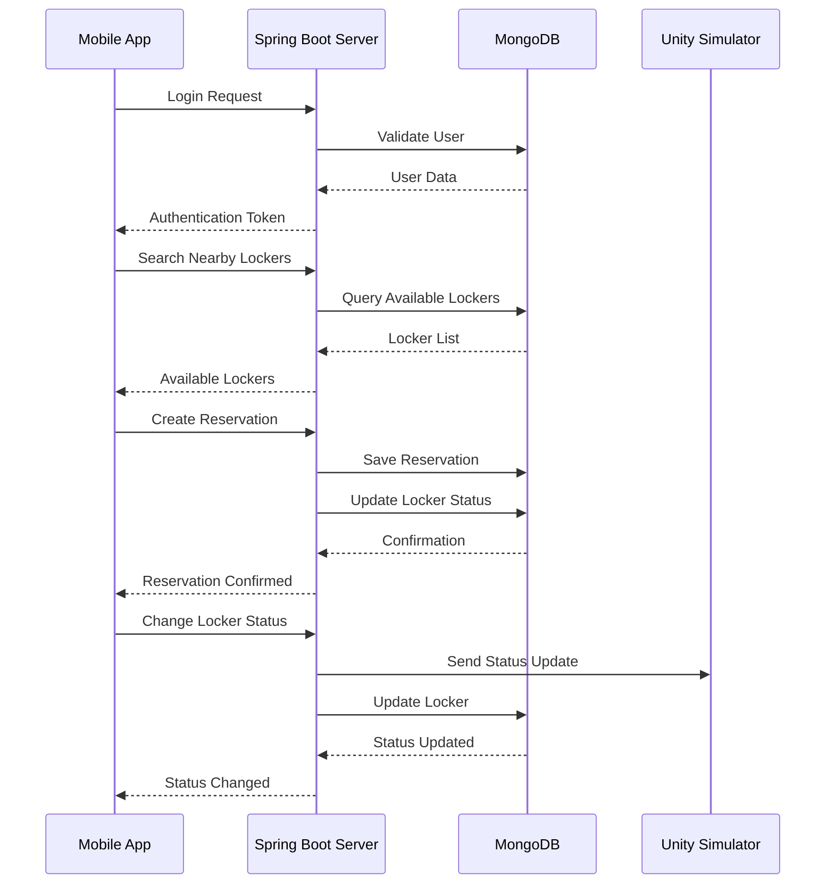

## 📱 Mobile App Features

### 🔑 Login/Registration Screen
- User registration with email validation
- Secure user authentication
- Welcome screen with app introduction
- Input validation and error handling

| Welcome | Login | Sign Up |
|--------|-------|---------|
| 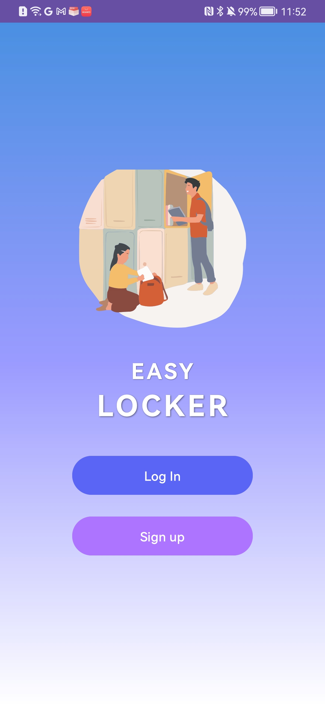 | 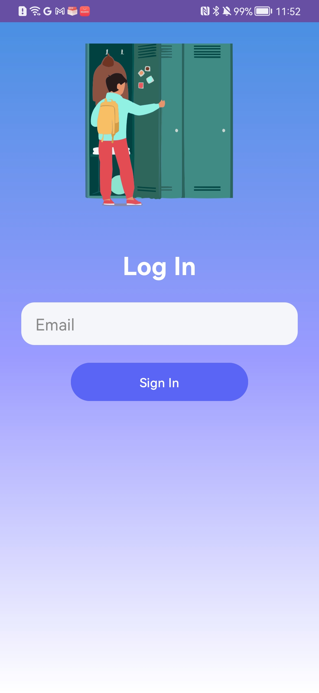 | 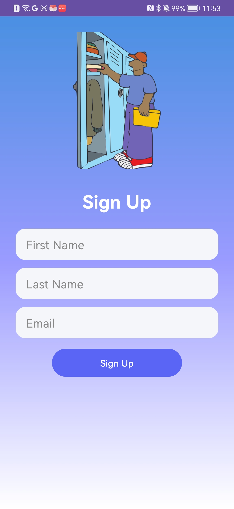 |

### 🗺️ Map Screen
- Interactive Google Maps integration
- Real-time locker location markers
- Address search functionality
- Location-based locker filtering

| Search| Active Lockers||
|-------|-------|-------|
| 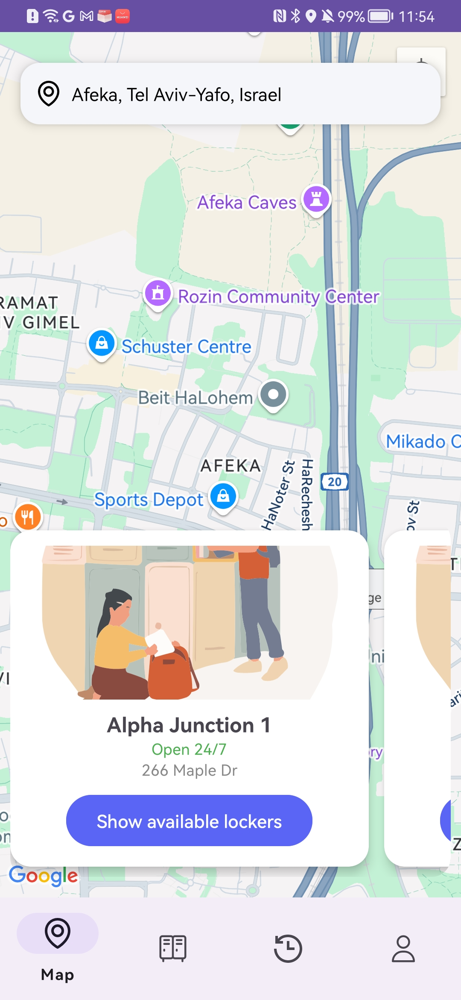 | 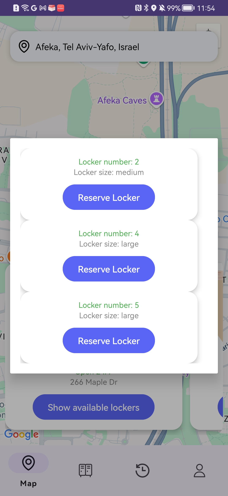 |  |

### 📦 Reservation Management
- View current active reservations
- Countdown timer for reservation expiration
- Quick actions: Arrived, Cancel, Finish
- NFC locker scanning for secure access
- Physical locker control (lock/unlock)
- Reservation status tracking

| Active Reservations| Countdown timer| Finish Reservation|
|-------|-------|-------|
| 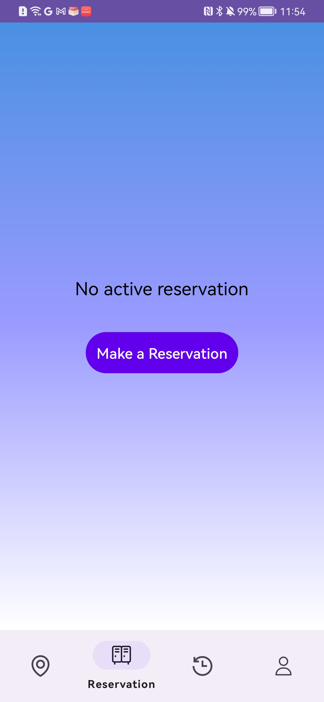 | 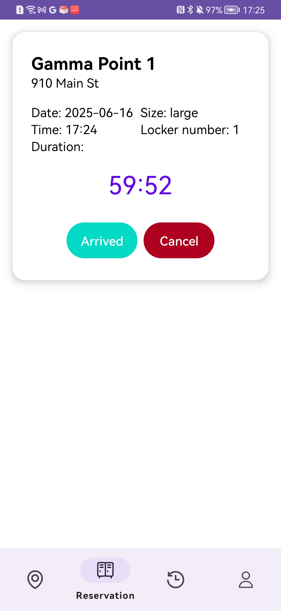 | 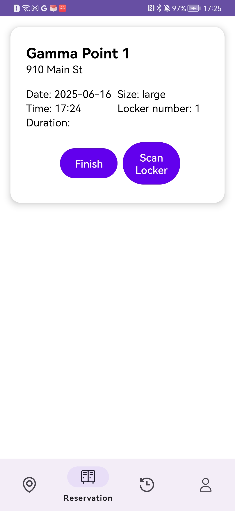 |

### 🗃️ History Screen
- Complete reservation history
- Detailed reservation information
- Chronological ordering

||||
|-------|-------|-------|
| 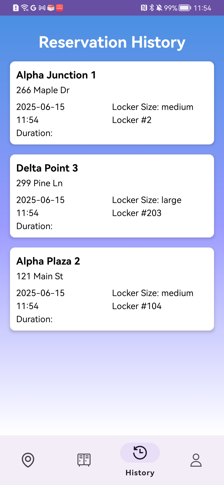 |  |  |

### 👤 Profile Management
- Editable user information
- Secure logout functionality
- Settings and preferences

||||
|-------|-------|-------|
| 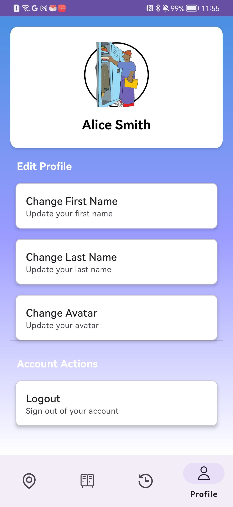 |  |  |

## 📱 NFC Integration

The application includes Near Field Communication (NFC) capabilities for secure locker access:

### NFC Features
- **Locker Scanning**: Users can scan NFC tags on physical lockers
- **Status Control**: Toggle lock/unlock status through NFC interaction
- **Security Validation**: Verify reservation ownership before locker access
- **Real-time Updates**: Immediate status synchronization with server

### NFC Implementation
- NFC reader mode activation when scanning is required
- Tag validation against current reservation
- Error handling for incorrect locker tags
- Automatic NFC mode deactivation after use

### Alternative Access Method
For testing purposes or devices without NFC, a "Scan Locker" button provides:
- Direct locker status control
- Same validation and security checks
- Manual trigger for lock/unlock operations


*This project demonstrates a complete full-stack application with modern development practices, clean architecture, and user-focused design.*

